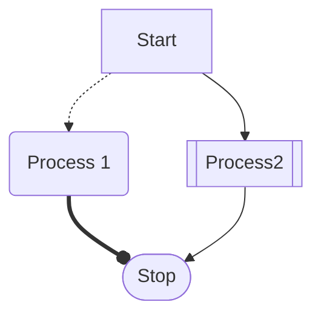
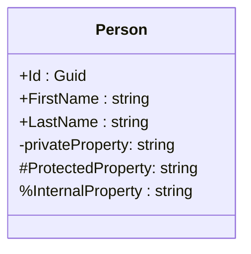

# Object Oriented Programing

A quick demo using Mermaid

##Flowcharts

```mermaid
graph TB
	A[Start] -.-> B(Process 1)
	A --> C[[Process2]]
	B ==o D([Stop])
	C --> D
```

```mermaid
classDiagram
	class Person{
		+Id : Guid
		+FirstName : string
		+LastName : string
		-privateProperty: string
		#ProtectedProperty: string
		%InternalProperty : string
	}
```