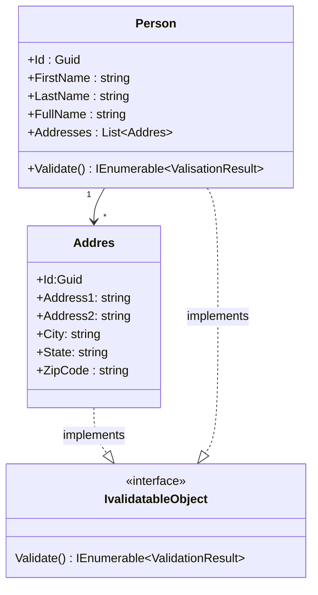

### Class Diagrams

```mermaid
classDiagram
	class IvalidatableObject{
		<<interface>>
		Validate() IEnumerable~ValidationResult~
	}

	class Addres{
		+Id:Guid
		+Address1: string
		+Address2: string
		+City: string
		+State: string
		+ZipCode : string
	}

	Addres ..|> IvalidatableObject: implements

	class Person{
		+Id : Guid
		+FirstName : string
		+LastName : string
		+FullName : string
		+Addresses : List~Addres~
		+Validate() IEnumerable~ValisationResult~
	}

	Person ..|> IvalidatableObject : implements
	Person "1" --> "*" Addres


```